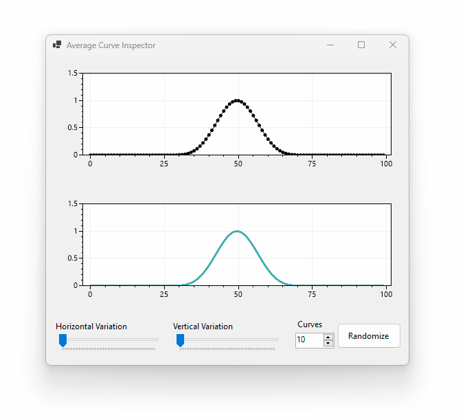

# Average Curve Inspector

The Average Curve Inspector is a Windows application for visualizing how randomness in the phase and amplitude of Gaussian curves changes the population's mean and variance.

### Download

* A zipped EXE is on the [releases page](https://github.com/swharden/Average-Curve-Inspector/releases/)